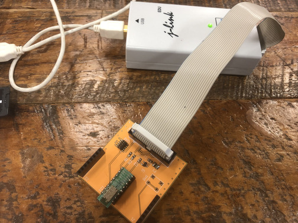

# AEBLE_Dock

秋月電子で販売しているBLEモジュール[AE-TYBLE16](http://akizukidenshi.com/catalog/g/gK-12339/)を、J-LINKでデバッグしやすくする基板です。

## 作り方

## 資料

- [部品表](https://docs.google.com/spreadsheets/d/1xVUbobURHwBgAgbBJVKqeSEPdVH2p0qffykU0qcphyc/edit?usp=sharing)
- [回路図](./schematic.pdf)
- [ガーバー](./Gerber)
